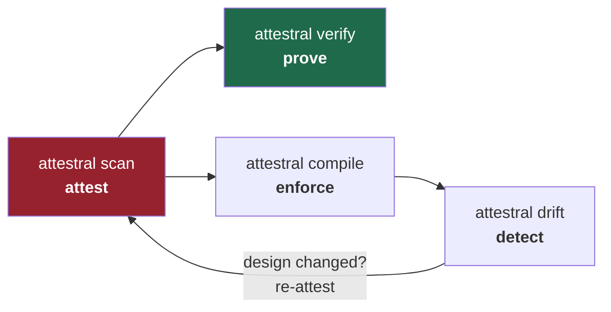
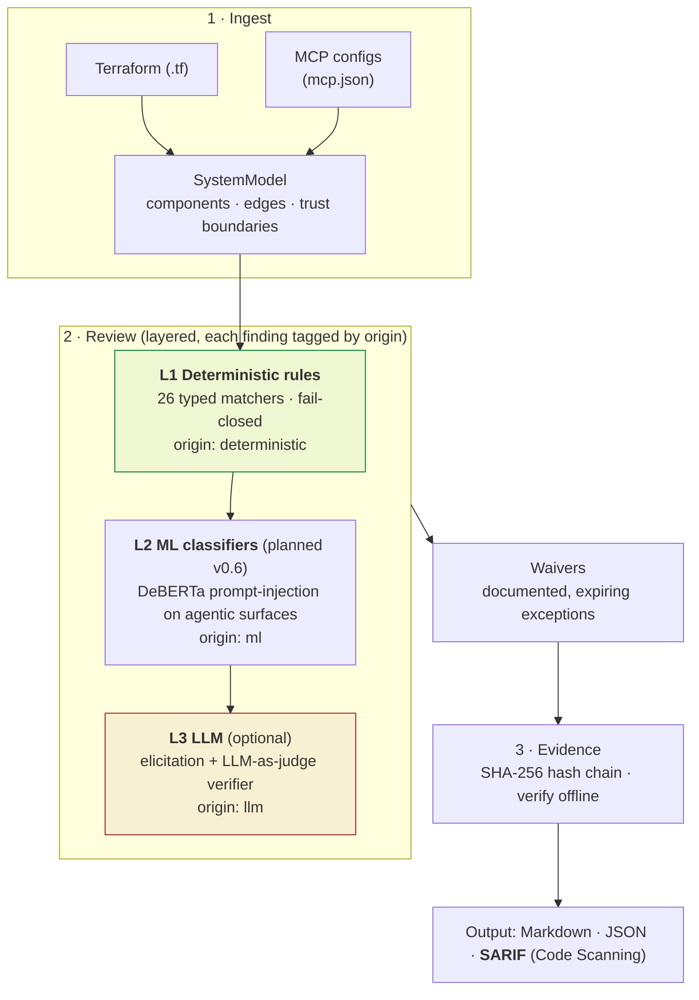
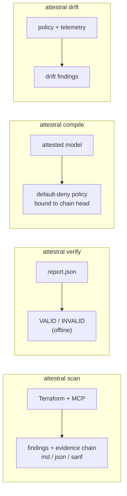

# Attestral

[](https://pypi.org/project/attestral/)
[](https://github.com/attestral-labs/attestral/actions/workflows/ci.yml)
[](https://pypi.org/project/attestral/)
[](LICENSE)

**Continuous, audit-ready security design review for cloud and agentic systems.**

Attestral reads your Terraform and MCP/agent configs, builds one system model, reviews it against a deterministic rule pack (with optional LLM reasoning and an LLM-as-judge), and emits a design review with a **tamper-evident evidence chain** you can hand to reviewers, auditors, and customers. It then compiles the reviewed design into a runtime policy and diffs live telemetry back against it.

```bash
pip install attestral
attestral scan ./my-project
```

## The loop in one picture



Attest the design, prove the record has not been altered, compile it into a default-deny runtime policy, and detect when what runs diverges from what was reviewed. The whole loop runs offline, on a laptop, free.

## How a scan works (the pipeline)



| Layer | What it does | Reproducible? | Cost |
|---|---|---|---|
| **L1 Deterministic** | 26 typed matchers over the model, fail-closed (unknown matcher never matches) | Yes, fully | Free, offline |
| **L2 ML** (planned v0.6) | Local transformer (DeBERTa) for prompt-injection / capability classification on MCP surfaces | Pinned model + revision | Free, offline |
| **L3 LLM** (optional) | Elicits novel design threats, and a judge cross-examines findings to cut false positives | Verdicts recorded in the chain | Your API key |

Every finding carries its `origin`, so the deterministic core is never silently mixed with model reasoning. That separation is what makes the review audit-grade.

## Install and run the whole loop (60 seconds)

```bash
pip install attestral

attestral scan examples/demo-project -o review        # attest  -> review.md + review.json
attestral verify review.json                          # prove   -> chain VALID
attestral compile examples/demo-project -o policy.yaml # enforce -> default-deny policy
attestral drift policy.yaml examples/demo-project/runtime-events.jsonl --fail-on-drift  # detect
```

## The four commands



```bash
# SCAN: review a project (Terraform + MCP configs discovered automatically)
attestral scan ./my-project --format both          # md + json
attestral scan . --fail-on high                    # CI gate: exit 1 on high/critical
attestral scan . --format sarif -o attestral       # SARIF -> GitHub Security tab + PR annotations

# VERIFY: prove a report has not been altered (no network, no server)
attestral verify review.json

# COMPILE: turn the attested design into a default-deny mcp-guard policy
attestral compile ./my-project -o policy.yaml

# DRIFT: diff runtime telemetry against the attested design
attestral drift policy.yaml events.jsonl --fail-on-drift
```

## The sophistication layers (optional)

```bash
# LLM threat elicitation on top of the deterministic layer
export ANTHROPIC_API_KEY=...
attestral scan ./my-project --llm

# LLM-as-judge: cross-examine findings to cut false positives.
# Verdicts (confirmed / false_positive / needs_review) are recorded in the chain.
export ATTESTRAL_JUDGE_API_KEY=...                 # or reuse ANTHROPIC_API_KEY
attestral scan . --judge --judge-panel 3           # 3 judges vote per finding
attestral scan . --judge --judge-suppress          # auto-waive confident false positives, on the record
```

The judge never deletes a finding. A confident `false_positive` becomes a machine-generated waiver carrying the judge's reasoning: suppressed from the gate, but kept on the record.

## Baseline and waivers

Real repos start with findings. A waiver accepts a known risk and keeps the gate green without hiding anything: the waived finding stays in the evidence chain with its justification, and becomes a SARIF suppression (GitHub shows it dismissed, not open).

```yaml
# attestral-waivers.yaml  (auto-discovered at the scan root)
waivers:
  - rule: ATL-005
    component: aws_db_instance.app     # or "*" for every component
    reason: Encryption enforced at the storage layer; tracked in SEC-1234.
    expires: 2026-12-31                # optional
```

Fail-safe: a waiver with no `reason` is ignored, and an expired waiver stops suppressing. A finding can only be silenced by a current, justified exception.

## What it catches (26-rule pack)

| Area | Examples |
|---|---|
| **Cloud misconfig** (AWS, CIS-grounded) | public S3/RDS/Redshift, `0.0.0.0/0` security groups, wildcard IAM, unencrypted RDS/EBS/Neptune, disabled backups, KMS rotation off, public EC2 IPs |
| **Agentic / MCP** (OWASP LLM Top 10, MCP research) | shell-capable servers, broad filesystem roots, non-TLS transport, secrets in env, auto-installed packages (supply chain), mutable `@latest` tags (rug-pull), outbound-fetch/browser tools |
| **Cross-cutting** | agent runtime and cloud sharing no declared boundary controls |

Every finding maps to NIST 800-53, ASVS, SOC 2, OWASP LLM/Agentic, and MITRE ATLAS references.

## Real-world benchmark

Run on [TerraGoat](https://github.com/bridgecrewio/terragoat) (Bridgecrew's deliberately-vulnerable Terraform), same repo, two rule packs:

| | Findings on TerraGoat AWS |
|---|---|
| v0.4.0 (10 rules) | 3 |
| v0.5.0 (26 rules) | **6** |

The pipeline (ingest, evidence chain, tamper detection, gate, SARIF) is verified on real code; the rule pack keeps growing to raise coverage.

## Use it in CI

```yaml
# .github/workflows/attestral.yml
name: attestral
on: [pull_request]
permissions:
  contents: read
  security-events: write        # to upload to the Security tab
jobs:
  design-review:
    runs-on: ubuntu-latest
    steps:
      - uses: actions/checkout@v5
      - uses: actions/setup-python@v6
        with: { python-version: "3.12" }
      - run: pip install "attestral[terraform]"
      - run: attestral scan . --format sarif -o attestral
      - uses: github/codeql-action/upload-sarif@v3
        with: { sarif_file: attestral.sarif }
      - run: attestral scan . --fail-on high      # hard gate (auto-uses attestral-waivers.yaml)
```

Ready-made workflows live in `examples/github-actions/`.

## Writing custom rules

Rules are YAML with structured matchers. No `eval` anywhere, and an unknown matcher fails closed (never matches).

```yaml
rules:
  - id: ORG-001
    title: Internal load balancer missing auth attribute
    severity: high
    target: aws_lb                     # component type prefix, or "model"
    match: { attr_missing: auth }
    description: ...
    recommendation: ...
    frameworks: ["NIST AC-3", "SOC2 CC6.1"]
```

```bash
python -c "from attestral.rules import RuleEngine; RuleEngine(['org_rules.yaml'])"
```

## Development

```bash
pip install -e ".[dev,terraform,llm]"
pytest -q                 # offline suite; the live judge test skips without a key
ruff check attestral tests
```

To run the live judge test, set `ATTESTRAL_JUDGE_API_KEY` (or `ANTHROPIC_API_KEY`) and re-run `pytest -q`.

## License

Apache 2.0.
